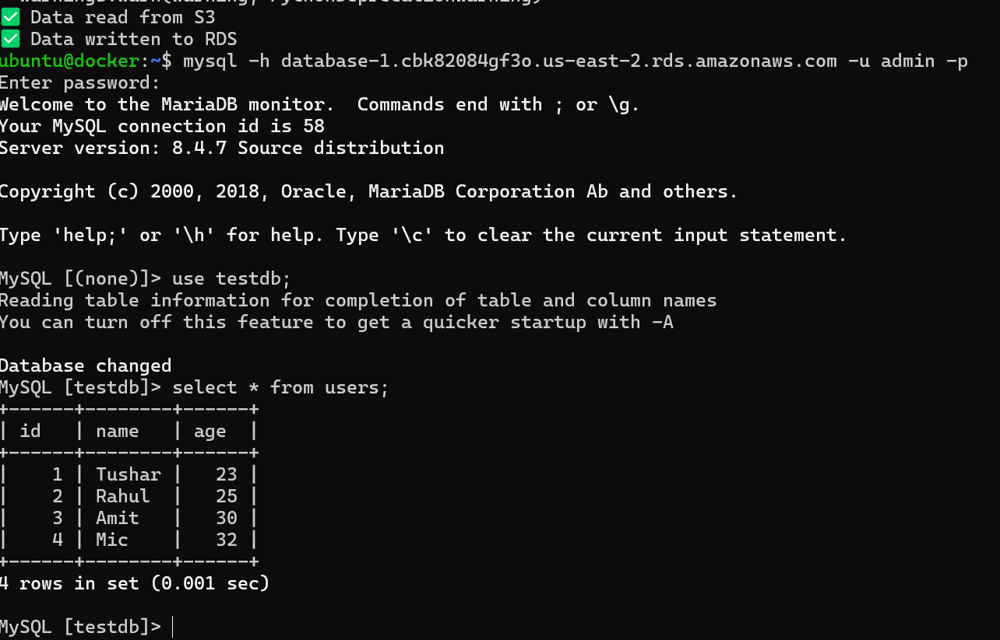
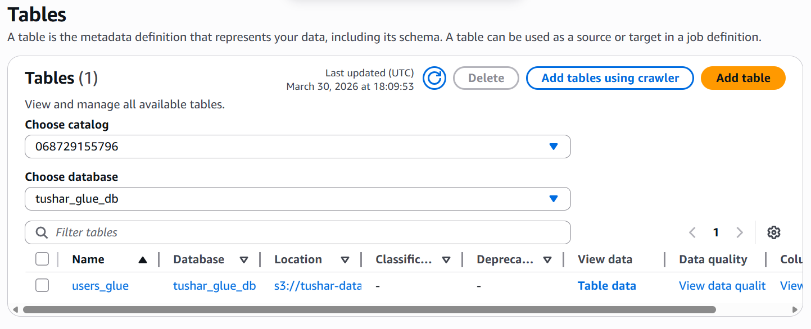
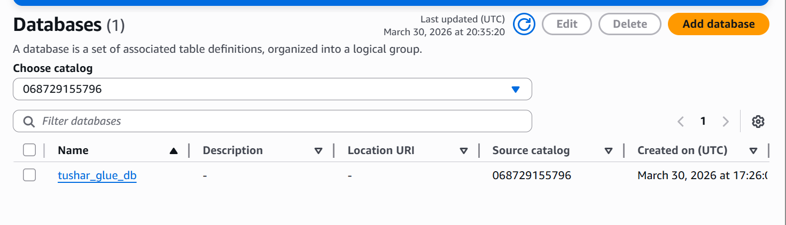
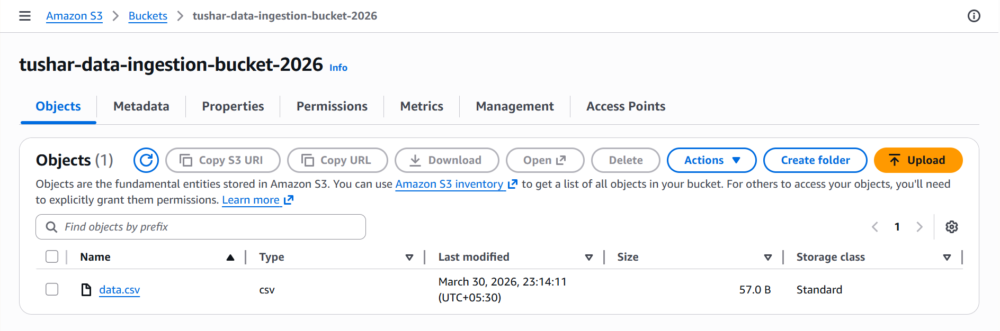

# 🚀 Data Ingestion Pipeline (S3 → RDS with Glue Fallback)

## 📌 Overview
This project implements a fault-tolerant, Dockerized data ingestion pipeline that:

- Reads CSV data from Amazon S3
- Attempts to load the data into Amazon RDS (MySQL)
- Automatically falls back to AWS Glue Data Catalog if RDS fails

---

## 🏗️ Architecture
```
S3 → Python (Docker) → RDS  
                          ↘ (Failure) → Glue Catalog  
```

---

## 🧰 Tech Stack

- Python (Pandas, Boto3, SQLAlchemy, PyMySQL)
- Docker
- AWS Services:
  - Amazon S3
  - Amazon RDS (MySQL)
  - AWS Glue
  - IAM

---

## 📂 Project Structure

```
project-root/
│
├── app.py
├── Dockerfile
├── requirements.txt
├── README.md
└── screenshots/
    ├── rds_output.png
    └── glue_table.png
```

---

## ⚙️ Setup Instructions

### 1️⃣ Build Docker Image

```bash
docker build -t s3-rds-glue-app .
```
### 2️⃣ Run Docker Container

```bash
docker run \
-e AWS_ACCESS_KEY_ID=<YOUR_KEY> \
-e AWS_SECRET_ACCESS_KEY=<YOUR_SECRET> \
-e AWS_DEFAULT_REGION=<REGION> \
-e S3_BUCKET=<S3_BUKET_NAME> \
-e S3_KEY=data.csv \
-e RDS_HOST=<RDS_ENDPOINT> \
-e RDS_USER=admin \
-e RDS_PASSWORD=<YOUR_DB_PASSWORD> \
-e RDS_DB=<RDS_DATABASE_NAME> \
-e RDS_TABLE=users \
-e GLUE_DB=<GLUE_DATABASE_NAME> \
-e GLUE_TABLE=users_glue \
s3-rds-glue-app
```

✅ Successful RDS Ingestion 

```OUTPUT
/usr/local/lib/python3.9/site-packages/boto3/compat.py:89: PythonDeprecationWarning: Boto3 will no longer support Python 3.9 starting April 29, 2026.
✅ Data read from S3
✅ Data written to RDS
```

❌ Fallback Scenario (RDS Failure)

```
/usr/local/lib/python3.9/site-packages/boto3/compat.py:89: PythonDeprecationWarning: Boto3 will no longer support Python 3.9 starting April 29, 2026.
✅ Data read from S3
❌ RDS Failed: (pymysql.err.OperationalError) (2003, "Can't connect to MySQL server (timed out)")
✅ Glue table created
```

## 📸 Screenshots

### ✅ RDS Output


### 🔁 Glue Fallback


### 🔁 Glue Database


### 🔁 S3 Bucket


⚠️ Challenges & Solutions

🔴 RDS Connection Timeout

Issue: Unable to connect to database
Fix:
Enabled public access
Opened port 3306 in security group

🔴 Database Not Found

Issue: No DB created during RDS setup
Fix:
```
CREATE DATABASE testdb;
```

🔴 Special Character in Password

Issue: $ caused shell parsing issues
Fix:
`-e RDS_PASSWORD=pass\$123 OR -e RDS_PASSWORD='<password>'`

🔴 Python Deprecation Warning

Issue: Python 3.9 deprecated
Fix: Updated Dockerfile:

```
FROM python:3.11
```

✅ Outcome
Successfully built a real-world data pipeline
Verified:
Data ingestion into RDS
Automatic fallback to Glue
Demonstrates fault tolerance and AWS service integration
